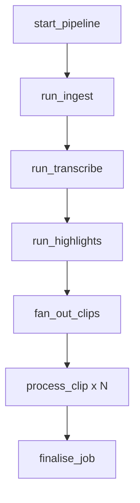
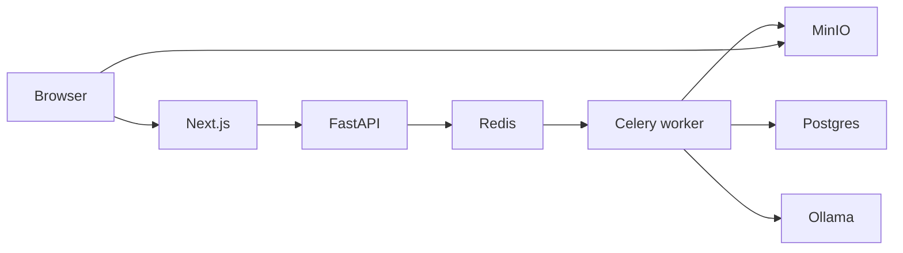

# Figma diagram guide for StreamClip TDD

## Tools

| Need | Tool | Skill |
|------|------|-------|
| Pipeline / architecture flow | `generate_diagram` | `figma-generate-diagram` |
| UX journey flow | `generate_diagram` flowchart | same |
| Module mindmap | FigJam stickies + connectors | `figma-use-figjam` |

`generate_diagram` does **not** support Mermaid `mindmap`. Use a hub flowchart or FigJam stickies.

## Standard diagrams to maintain

1. **System architecture** — LR flowchart: Browser, Next.js, FastAPI, Redis, Celery, Postgres, MinIO, Ollama
2. **Pipeline flow** — ingest → transcribe → highlights → fan-out → process_clip → finalise
3. **UX journey** — paste URL / upload → create job → SSE progress → clip grid → download
4. **Module mindmap** — center: StreamClip; branches: ingest, transcribe, highlights, reframe, captions, overlay, web, api

## Mermaid examples

### Pipeline (flowchart TD)



### Architecture (flowchart LR)



## After generation

Record URLs in `docs/design/FIGMA_LINKS.md`:

```markdown
| Diagram | URL | Updated |
|---------|-----|---------|
| Architecture | https://figma.com/board/... | YYYY-MM-DD |
```
